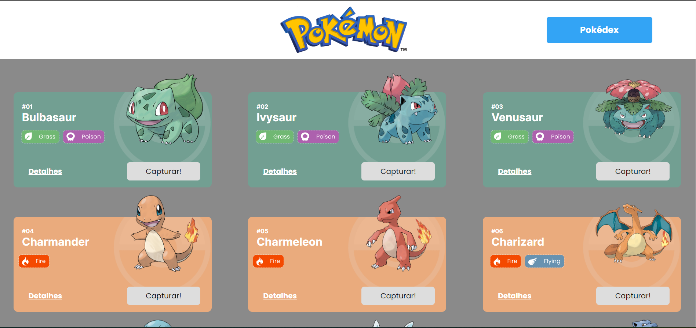
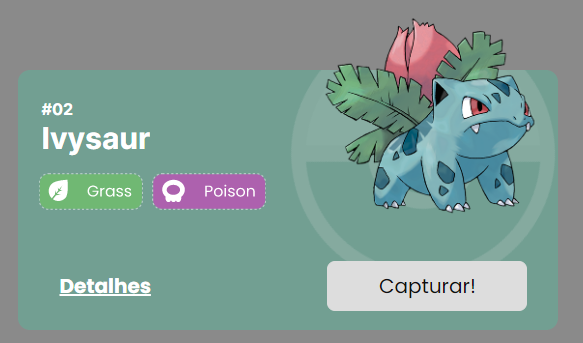
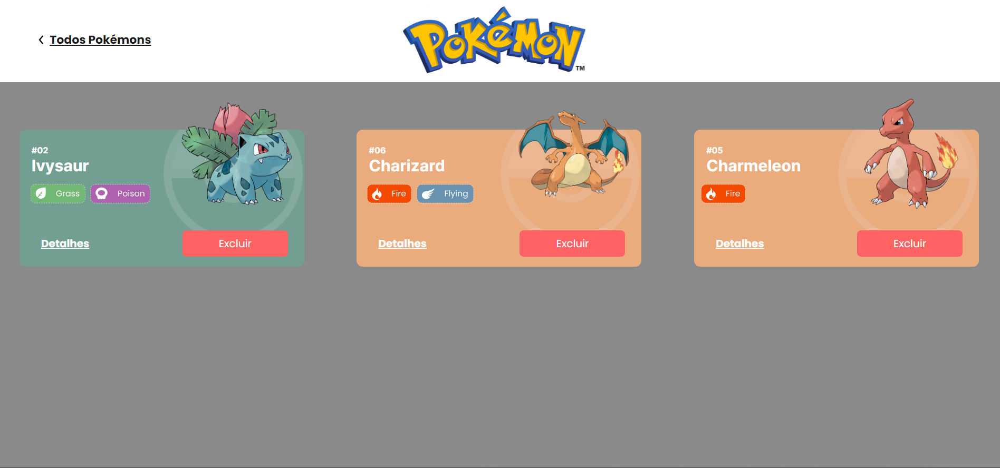
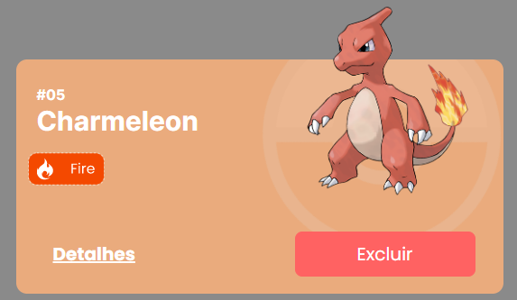
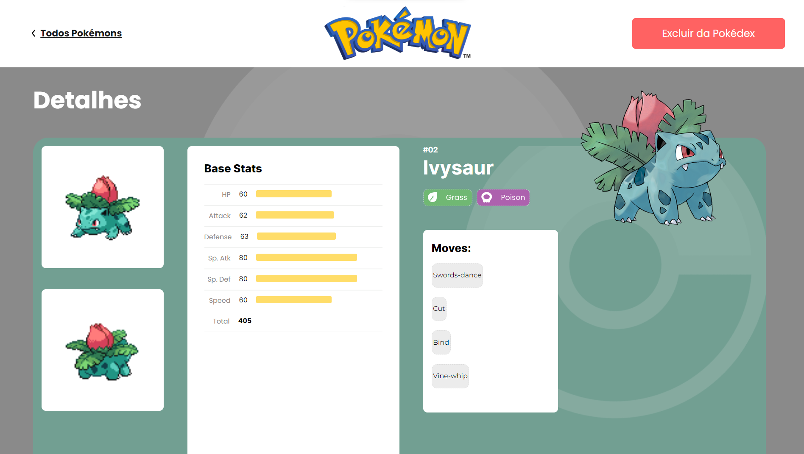

# Projeto Pokédex


O Projeto Pokédex é uma aplicação que permite ao usuário escolher diversos pokémons para serem adicionados, ou removidos, da sua pokédex. É possível também visualizar as características de cada pokémon na página de detalhes, tais como, ataques, estatísticas e tipos.

## Índice
- <a href="#funcionalidades">Funcionalidades do projeto</a>
- <a href="#layout">Layout</a>
- <a href="#demonstração">Demonstração</a>
- <a href="#rodar">Como rodar o projeto</a>
- <a href="#tecnologias-utilizadas"> Tecnologias utilizadas</a>
- <a href="#autora">Pessoa autora</a>
- <a href="#proximos-passos">Próximos passos</a>

## Funcionalidades do projeto

 - [x] Lista de pokémons
 - [x] Adicionar e remover pokémons
 - [x] Pokédex com os pokémons adicionados
 - [x] Detalhes do pokémon selecionado

## Layout






## Demonstração
[Link Demonstração (deploy)](https://draconian-poison.surge.sh/)

## Como rodar o projeto
```bash
# Clone este repositório
$ git clone linkrepo

# Acesse a pasta do projeto no seu terminal
$ cd projeto-pokedex

# Instale as dependências
$ npm install

# Execute a aplicação 
$ npm run dev

# Acesse a apicação pelo navegador:
http://127.0.0.1:5173/
```

## Tecnologias utilizadas
1. [React JS](https://react.dev/)
2. [Vite](https://vitejs.dev/)
3. Styled-components
4. React Router
5. React Context
6. [PokéAPI](https://pokeapi.co/)

## Pessoa autora 
[LinkedIn](https://www.linkedin.com/in/julia-silva-borges/)

## Próximos passos
- [ ] Deixar o layout responsivo para diferentes tamanhos de tela
- [ ] Implementar bibliotecas de estilização (Design Systems)
- [ ] Implementar uso do LocalStorage para salvamento temporário do conteúdo da pokédex
