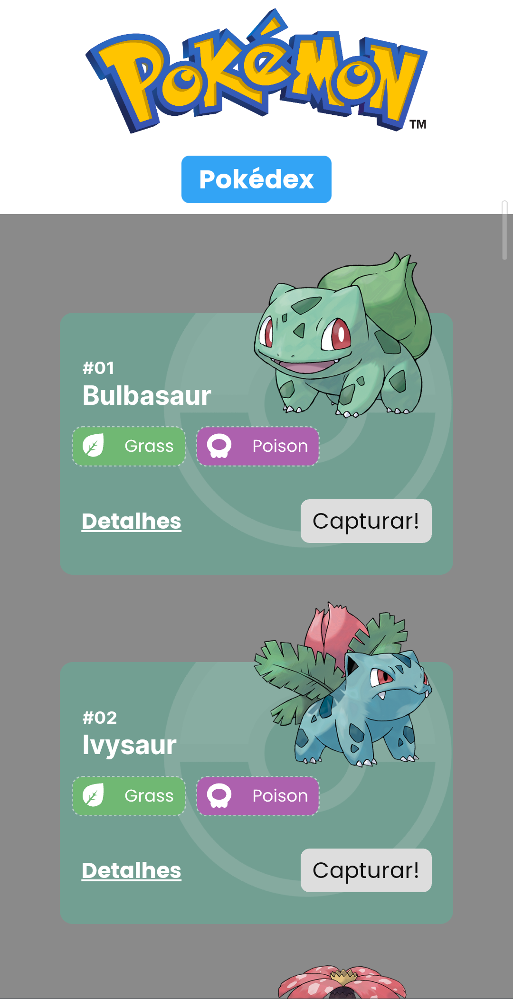
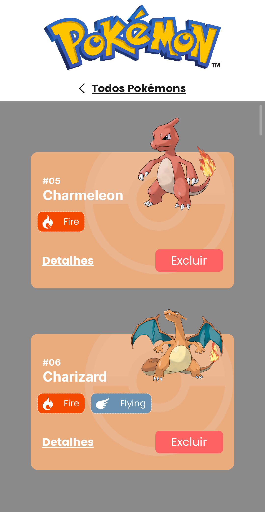
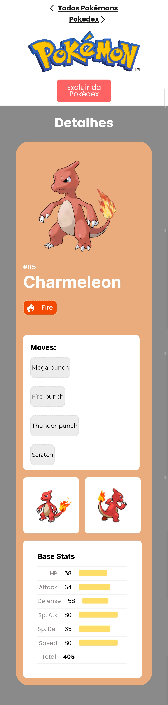

# Projeto Pokédex


O Projeto Pokédex é uma aplicação que permite ao usuário escolher diversos pokémons para serem adicionados, ou removidos, da sua pokédex. É possível também visualizar as características de cada pokémon na página de detalhes, tais como, ataques, estatísticas e tipos.

## Índice
- <a href="#funcionalidades">Funcionalidades do projeto</a>
- <a href="#layout">Layout</a>
- <a href="#demonstração">Demonstração</a>
- <a href="#rodar">Como rodar o projeto</a>
- <a href="#tecnologias-utilizadas"> Tecnologias utilizadas</a>
- <a href="#autora">Pessoa autora</a>
- <a href="#proximos-passos">Próximos passos</a>

## Funcionalidades do projeto

 - [x] Página com lista de cards de pokémons
 - [x] Adicionar e/ou remover pokémons da pokédex
 - [x] Pokédex com card dos pokémons adicionados
 - [x] Detalhes do pokémon selecionado

## Layout
1. Versão Desktop


2. Versão mobile


<br/>


## Demonstração

[Link Demonstração (deploy)](https://light-horn.surge.sh/) 

https://github.com/Julia-slvbrg/projeto-pokedex/assets/114543081/d2b2fa77-f9b0-4f37-b63e-f7cd0cfce589


## Como rodar o projeto
```bash
# Clone este repositório
$ git clone linkrepo

# Acesse a pasta do projeto no seu terminal
$ cd projeto-pokedex

# Instale as dependências
$ npm install

# Execute a aplicação 
$ npm run dev

# Acesse a apicação pelo navegador:
http://127.0.0.1:5173/
```

## Tecnologias utilizadas
1. [React JS](https://react.dev/)
2. [Vite](https://vitejs.dev/)
3. Styled-components
4. React Router
5. React Context
6. [PokéAPI](https://pokeapi.co/)
7. Media Query

## Pessoa autora 
[LinkedIn](https://www.linkedin.com/in/julia-silva-borges/)

## Próximos passos
 - [X] Implementar responsividade do layout para vizualição em celulares
 - [ ] Implementar responsividade do layout para vizualição em monitores grandes
 - [ ] Implementar bibliotecas de estilização (Design Systems)
 - [X] Implementar uso do LocalStorage para salvamento temporário do conteúdo da pokédex
